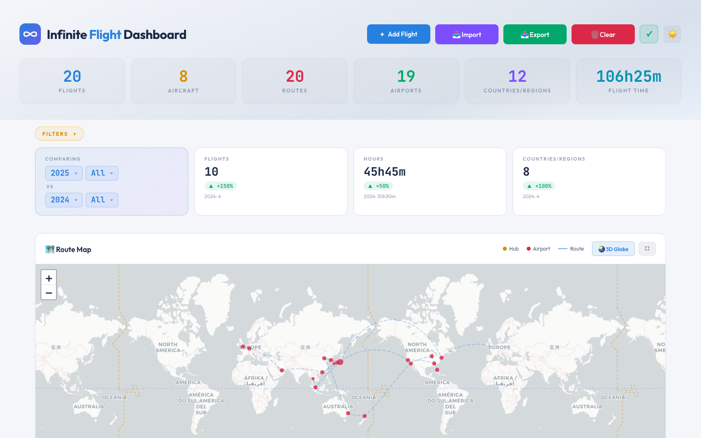
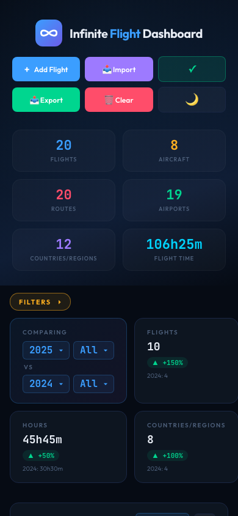

<div align="center">

# ✈️ Infinite Flight Dashboard

**为 [Infinite Flight](https://infiniteflight.com) 飞行员打造的精美、私密的飞行日志仪表盘。**

### → [**打开仪表盘**](https://aki-12138.github.io/Infinite-Flight-Dashboard/) ←

`aki-12138.github.io/Infinite-Flight-Dashboard`

[English](README.md) · [日本語](README.ja.md) · [简体中文](README.zh-CN.md) · [报告 Bug](https://github.com/AKI-12138/Infinite-Flight-Dashboard/issues)


</div>

---

## 这是什么？

一个简洁、私密的仪表盘，能把你的 Infinite Flight 飞行记录转换成精美的图表、世界航线图和 3D 地球仪。**数据全程不离开你的设备** — 无需注册、无上传、无追踪。

为想要**看见**自己飞行旅程的 IF 飞行员而生：最常飞的机型、覆盖过的航线、飞行时间是怎么一年年增长的。

| 浅色模式 | 深色模式 |
|---|---|
|  |  |

## 你能做什么

- **一眼看全统计** — 总飞行数、总小时数、用过的机型、飞过的国家，全部显示在顶部
- **应有尽有的图表** — 你的常用机型、常用航司、常用航线、常用机场、常用国家；以及年度、月度、星期分布
- **世界航线图** — 每一次飞行都以大圆航线（地球最短路径）绘出，枢纽机场和经停机场都标记出来
- **3D 地球仪转动航线** — 从任何角度欣赏自己的飞行轨迹
- **筛选与对比** — 按年、月、星期、航司、机型或国家筛选；内置同比对比，"今年比去年多飞了多少？"一目了然
- **轻松导入** — 飞行记录几乎任何格式都能直接粘贴。日期、机型代码、航司名称自动识别
- **内置 172 个机场** — 全球主要机场已预装；如果你飞到不常见的地方可以手动添加
- **快速搜索** — 用 `RJTT→KJFK B77W 2025` 这种简单写法瞬间找到特定航班
- **浅色 / 深色主题** — 自由选择，或让它跟随手机系统设置
- **手机也能用** — 同一仪表盘，移动端友好布局
- **打开链接即用** — 无需安装、无需注册、无需任何设置


## 怎么开始用

在任意现代浏览器打开这个链接:

**→ [aki-12138.github.io/Infinite-Flight-Dashboard](https://aki-12138.github.io/Infinite-Flight-Dashboard/)**

就这么简单。第一次打开时，仪表盘是空的，会显示两个按钮 — **Import CSV**（已有飞行记录的人）或 **Add your first flight**（从第一条记录开始的人）。下面这份指南会逐项介绍进入之后能做的事情。

> 💡 **小提示:** 在手机上，可以通过浏览器的分享菜单"添加到主屏幕"，让仪表盘像一个 App 一样使用。

## 使用方法

### 通过 CSV 导入航班

点击 **📥 Import**（顶部）或空状态的 **📂 Import CSV**，然后选择文件或直接粘贴 CSV。

**所需格式（6 列）:**

```
date,dep,arr,aircraft,airline,duration
2025-06-01,RJTT,RJOO,B772,ANA,1h15m
2025/6/2,rjoo,rjtt,a359,Japan Airlines,1:10
25-06-03,RJTT,RJCC,b77w,ANA,90m
```

**导入器很宽容。** 自动处理：
- 日期变体: `2025-06-01`、`2025/6/1`、`25-06-01`、`20250601`
- 时间变体: `1h15m`、`1:30`、`90m`、`1h30`、`1.5h`
- 机型代码: `B772`、`b772`、`B-772`、`Boeing 777-200`（尽量整理为标准形式）
- 航司名称: `ANA`、`All Nippon Airways`、`Japan Airlines`、`JAL`
- 分隔符: 英文逗号（`,`）、中文逗号（`、`）、TAB
- 注释: 以 `#` 开头的行被忽略
- 重复项: 相同日期 + 航线 + 机型 + 航司 + 时间会被自动去除

某一行解析失败时，导入器会精确告诉你是哪一行、为什么。

### 添加单个航班

点击 **+ Add Flight**（顶部）或空状态的 **+ Add your first flight**。填写：

| 字段 | 示例 | 备注 |
|---|---|---|
| Date | `2025-06-01` | 日期选择器强制格式 |
| Flight Time | `1` h `15` m | 两个数字输入框 |
| Departure (ICAO) | `RJTT` | 4 字母 ICAO 代码 |
| Arrival (ICAO) | `RJOO` | 4 字母 ICAO 代码 |
| Aircraft | `B772` | ICAO 机型代码 |
| Airline | `ANA` | IATA 代码或全名，自动规范化 |

点击 **Add Flight** 保存。

### 添加自定义机场

App 内置 **172 个机场**（全球主要枢纽）。如果你飞到一个内置数据库里没有的小型或军用机场，地图上会出现「Unknown airport」标记。要解决这个问题，请手动添加机场。

**在仪表盘中:**
1. 打开 **📥 Import** → 切换到 **🛩 Airports** 标签
2. 按以下格式粘贴 CSV 行：

```
icao,lat,lng,city,country,continent
RJBE,34.6328,135.2239,Kobe,Japan,Asia
```

**字段说明:**

| 字段 | 格式 | 示例 |
|---|---|---|
| `icao` | 4 字母 ICAO 代码 | `RJBE` |
| `lat` | 十进制度数（−90 到 +90） | `34.6328` |
| `lng` | 十进制度数（−180 到 +180） | `135.2239` |
| `city` | 显示名称 | `Kobe` |
| `country` | 英文国家名 | `Japan` |
| `continent` | 七大洲之一: `Asia`, `Europe`, `Africa`, `North America`, `South America`, `Oceania`, `Antarctica` | `Asia` |

自定义机场会和你的航班一起保存，并可在 Airports CSV 中导出。

### 如何查找经纬度

你需要的是**十进制度数（Decimal Degrees, DD）**，不是度分秒（DMS）。地图显示用，4-6 位小数足够。

| 来源 | 方法 |
|---|---|
| **维基百科** | 搜索机场名 → 右侧 Infobox 的「Coordinates」行。如果看到 `35°33'08"N` 这样的写法，请使用旁边的**十进制**形式（`35.5523°N 139.7798°E` → `35.5523,139.7798`）。 |
| **Google Maps** | 搜索机场 → 右键点击 → 点击菜单顶部的坐标即可复制。 |
| **OurAirports.com** | 用 ICAO 搜索 → 页面顶部显示坐标。 |
| **AirNav.com** | [airnav.com/airports](https://airnav.com/airports) → 用 ICAO 搜索。 |

**注意事项:**
- **符号很关键。** 南半球纬度为负（悉尼 `-33.9461`）；西半球经度为负（JFK `-73.7789`）。
- **所有符号都要去掉。** 不要 `°`、不要 `N`/`S`/`E`/`W`。只留数字和负号。
- **必须十进制，DMS 不行。** `35°33'08"N` 不能用 — 请先转换成 `35.5523`。

**示范（神户机场 RJBE）:**

| 源数据 | 应输入 |
|---|---|
| `34°37′58″N 135°13′26″E`（DMS） | ❌ 不能用 |
| `34.6328° N, 135.2239° E`（带符号的 DD） | ❌ 不能用 |
| `34.6328, 135.2239` | ✅ 这才正确 |

### 搜索

Flight Log 顶部有一个搜索框。**简单用法:** 输入任意关键词（航司名、机型、年份）即可筛选。**进阶用法:** 用空格分隔多个关键词，所有关键词都匹配的航班才会留下。

| 模式 | 作用 | 示例 |
|---|---|---|
| `RJTT→RJOO` | 航线筛选（出发 → 到达） | 东京到大阪的航班 |
| `RJTT->RJOO` | 同上 — `->`, `→`, `>`, `-` 都能用作箭头 | |
| `RJTT` | 涉及该机场的所有航班 | 所有羽田航班 |
| `JFK` | IATA 代码自动解析为 ICAO | 等同于 `KJFK` |
| `ANA` | 航司名称或代码 | 所有 ANA 航班 |
| `B789` | 机型 | 所有 787-9 航班 |
| `2025` | 年份 | 2025 年航班 |
| `2025-06` | 年-月 | 2025 年 6 月 |
| `-RJOO` | 排除（前缀 `-`） | 排除涉及大阪的航班 |
| 组合 | 空格分隔的 token 之间是 AND | `RJTT→KJFK B77W 2025` |

**例: 「2025 年所有飞过的东京-纽约 B77W 航班，但不包括飞 Newark 的」:**

```
RJTT→KJFK B77W 2025 -KEWR
```

### 筛选器

仪表盘顶部点击 **FILTERS ▾** 展开筛选栏。可用 chip：

- 🗓 **Year** — 多选
- 📅 **Month** — 多选
- 📆 **Weekday** — 多选
- 🏢 **Airline** — 多选，只列出你实际飞过的航司
- ✈️ **Aircraft** — 多选
- 🏞 **Country/Region** — 多选
- 🌐 **Scope** — All / Domestic / International

选择时仪表盘实时更新。**Comparing** 卡基于你当前的 Year 选择显示年度同比增减。

### 主题切换

右上角的主题切换按钮循环 3 个状态：

| 模式 | 图标 | 行为 |
|---|---|---|
| Auto | 🔄 | 跟随系统设置，系统主题切换时实时联动 |
| Light | ☀️ | 强制浅色 |
| Dark | 🌙 | 强制深色 |

选择会跨会话保留。



## 数据与隐私

- **100% 本地。** 你的航班数据存储在浏览器的 `localStorage` 中。无服务器、无分析、无 cookie、无第三方调用（除 CDN 字体/库加载外）。
- **无需账号。** 无需注册、无需登录。
- **轻松备份。** 任何时候点击 **📤 Export** 即可下载航班 CSV（可选包含自定义机场）。
- **轻松迁移。** 把导出的 CSV 拿到新设备 → **Import** → 完成。
- **轻松清除。** 点击顶部 **🗑 Clear** 即可删除所有数据（带确认对话框）。

如果你想确认「数据真的存好了吗？」，点击顶部的 ✓ 图标 — 会显示当前的存储状态。

## 运行环境

几乎所有现代浏览器，PC 和手机都能用:

- 💻 Windows / Mac / Linux 上的 Chrome、Safari、Firefox、Edge
- 📱 iPhone（Safari、Chrome）、安卓（Chrome、Samsung Internet）

如果遇到显示问题，可以试着把浏览器升级到最新版。

## 关于本项目

这是一个**个人爱好项目**，由一位 Infinite Flight 爱好者独自开发，分享给社区免费使用。

- **不保证持续维护或支持。** 更新可能不定期 — 甚至可能停止。
- **可能会有变更。** 功能、UI、数据格式甚至 URL，未来都可能在没有预先通知的情况下变化。
- **请自由使用，但不要将其用于关键工作流程。** 如果你的飞行历史对你很重要，请务必保留 CSV 备份。

话虽如此，如果你发现了 bug，欢迎 [提交 Issue](https://github.com/AKI-12138/Infinite-Flight-Dashboard/issues)，我有空时会看一下。无法承诺具体处理时间，但会读。

**还有一件事想说明：** 这些代码大部分是在 AI 编程助手（主要是 Claude）的帮助下完成的，由我提出方向和设计决策。我本人不是 JavaScript 开发者 — 这个项目能存在，是因为 AI 工具让一个非程序员也能做出像样的东西并分享出来。如果你在代码里发现奇怪的写法，多半是 AI 的习惯，或者是我说得不够清楚（更可能是后者 😅）。

## 给开发者

如果你是开发者，对它是怎么做的感兴趣，所有代码都在这个仓库里 — 是一个静态站点（HTML / CSS / JavaScript），没有构建步骤。后续可能会补充开发者文档。

## 鸣谢

由 [AKI-12138](https://github.com/AKI-12138) 为 Infinite Flight 社区开发。

献给每一位曾经想过「我到底飞了多少小时？」的 IF 飞行员。

感谢以下优秀的开源项目让这一切成为可能: [Leaflet](https://leafletjs.com/)（2D 地图）、[Chart.js](https://www.chartjs.org/)（图表）、[Globe.gl](https://globe.gl/)（3D 地球仪）、[Natural Earth](https://www.naturalearthdata.com/)（国界数据），以及 [Outfit](https://fonts.google.com/specimen/Outfit) 和 [JetBrains Mono](https://www.jetbrains.com/lp/mono/) 字体。感谢所有维护者。

## 许可证

**待定（TBD）。** 在添加许可证之前，默认版权适用 — 你可以阅读和查看代码，但请勿在未先咨询的情况下重新发布或商用。

---

<div align="center">

*与 Infinite Flight LLC 无关，未获其授权。*

</div>
